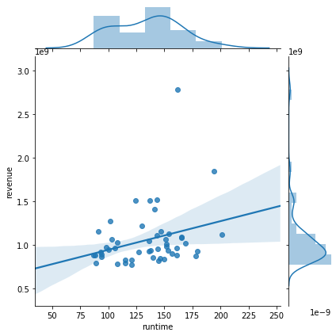
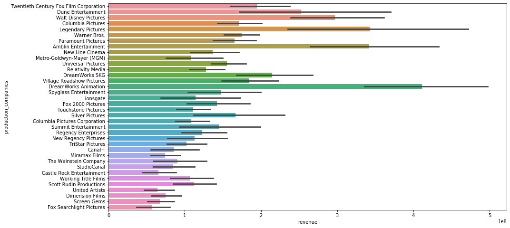

# Final Project Submission

Please fill out:
* Student name: Joseph Husney
* Student pace: full time
* Scheduled project review date/time: 8/06/2020 5:00 pm
* Instructor name: James Irving
* Blog post URL: https://jhusney1.github.io/reasons_to_use_webscraping_over_apis

## Introduction
Microsoft sees all the big companies creating original video content, and they want to get in on the fun. They have decided to create a new movie studio, but the problem is they don’t know anything about creating movies. They have hired you to help them better understand the movie industry.
Your team is charged with doing data analysis and creating a presentation that explores what type of films are currently doing the best at the box office. You must then translate those findings into actionable insights that the CEO can use when deciding what type of films they should be creating.
We will analyze our findings through three visuals. Hopefully, this will shed some light on which kinds of movies microsoft should invest in.

## Retrieve Data

### Import necessary modules


```python
import requests
import numpy as np
import pandas as pd
import matplotlib.pyplot as plt
import seaborn as sns
from pandasql import sqldf
pysqldf = lambda q: sqldf(q, globals())
from tqdm import tqdm
```


```python
#Allowing pandas to display unlimited info
# pd.set_option('display.max_rows', 1000)
# pd.set_option('display.max_columns', 1000)
```

### Importing dataframe
Before analyzing the data, it must first be retrieved. Inside the package given to us, there is a file that has all the movie info. We will use this info to get all kinds of details which we can further analyze. We will put this into a pandas dataframe so we can utilize all the tools pandas has to offer


```python
# Load csv file to dataframe
df = pd.read_csv('zippedData/tmdb_5000_movies.csv')
```


```python
# Preview data
df.head()
```


<div>
<style scoped>
    .dataframe tbody tr th:only-of-type {
        vertical-align: middle;
    }

    .dataframe tbody tr th {
        vertical-align: top;
    }

    .dataframe thead th {
        text-align: right;
    }
</style>
<table border="1" class="dataframe">
  <thead>
    <tr style="text-align: right;">
      <th></th>
      <th>budget</th>
      <th>genres</th>
      <th>homepage</th>
      <th>id</th>
      <th>keywords</th>
      <th>original_language</th>
      <th>original_title</th>
      <th>overview</th>
      <th>popularity</th>
      <th>production_companies</th>
      <th>production_countries</th>
      <th>release_date</th>
      <th>revenue</th>
      <th>runtime</th>
      <th>spoken_languages</th>
      <th>status</th>
      <th>tagline</th>
      <th>title</th>
      <th>vote_average</th>
      <th>vote_count</th>
    </tr>
  </thead>
  <tbody>
    <tr>
      <td>0</td>
      <td>237000000</td>
      <td>[{"id": 28, "name": "Action"}, {"id": 12, "nam...</td>
      <td>http://www.avatarmovie.com/</td>
      <td>19995</td>
      <td>[{"id": 1463, "name": "culture clash"}, {"id":...</td>
      <td>en</td>
      <td>Avatar</td>
      <td>In the 22nd century, a paraplegic Marine is di...</td>
      <td>150.437577</td>
      <td>[{"name": "Ingenious Film Partners", "id": 289...</td>
      <td>[{"iso_3166_1": "US", "name": "United States o...</td>
      <td>2009-12-10</td>
      <td>2787965087</td>
      <td>162.0</td>
      <td>[{"iso_639_1": "en", "name": "English"}, {"iso...</td>
      <td>Released</td>
      <td>Enter the World of Pandora.</td>
      <td>Avatar</td>
      <td>7.2</td>
      <td>11800</td>
    </tr>
    <tr>
      <td>1</td>
      <td>300000000</td>
      <td>[{"id": 12, "name": "Adventure"}, {"id": 14, "...</td>
      <td>http://disney.go.com/disneypictures/pirates/</td>
      <td>285</td>
      <td>[{"id": 270, "name": "ocean"}, {"id": 726, "na...</td>
      <td>en</td>
      <td>Pirates of the Caribbean: At World's End</td>
      <td>Captain Barbossa, long believed to be dead, ha...</td>
      <td>139.082615</td>
      <td>[{"name": "Walt Disney Pictures", "id": 2}, {"...</td>
      <td>[{"iso_3166_1": "US", "name": "United States o...</td>
      <td>2007-05-19</td>
      <td>961000000</td>
      <td>169.0</td>
      <td>[{"iso_639_1": "en", "name": "English"}]</td>
      <td>Released</td>
      <td>At the end of the world, the adventure begins.</td>
      <td>Pirates of the Caribbean: At World's End</td>
      <td>6.9</td>
      <td>4500</td>
    </tr>
    <tr>
      <td>2</td>
      <td>245000000</td>
      <td>[{"id": 28, "name": "Action"}, {"id": 12, "nam...</td>
      <td>http://www.sonypictures.com/movies/spectre/</td>
      <td>206647</td>
      <td>[{"id": 470, "name": "spy"}, {"id": 818, "name...</td>
      <td>en</td>
      <td>Spectre</td>
      <td>A cryptic message from Bond’s past sends him o...</td>
      <td>107.376788</td>
      <td>[{"name": "Columbia Pictures", "id": 5}, {"nam...</td>
      <td>[{"iso_3166_1": "GB", "name": "United Kingdom"...</td>
      <td>2015-10-26</td>
      <td>880674609</td>
      <td>148.0</td>
      <td>[{"iso_639_1": "fr", "name": "Fran\u00e7ais"},...</td>
      <td>Released</td>
      <td>A Plan No One Escapes</td>
      <td>Spectre</td>
      <td>6.3</td>
      <td>4466</td>
    </tr>
    <tr>
      <td>3</td>
      <td>250000000</td>
      <td>[{"id": 28, "name": "Action"}, {"id": 80, "nam...</td>
      <td>http://www.thedarkknightrises.com/</td>
      <td>49026</td>
      <td>[{"id": 849, "name": "dc comics"}, {"id": 853,...</td>
      <td>en</td>
      <td>The Dark Knight Rises</td>
      <td>Following the death of District Attorney Harve...</td>
      <td>112.312950</td>
      <td>[{"name": "Legendary Pictures", "id": 923}, {"...</td>
      <td>[{"iso_3166_1": "US", "name": "United States o...</td>
      <td>2012-07-16</td>
      <td>1084939099</td>
      <td>165.0</td>
      <td>[{"iso_639_1": "en", "name": "English"}]</td>
      <td>Released</td>
      <td>The Legend Ends</td>
      <td>The Dark Knight Rises</td>
      <td>7.6</td>
      <td>9106</td>
    </tr>
    <tr>
      <td>4</td>
      <td>260000000</td>
      <td>[{"id": 28, "name": "Action"}, {"id": 12, "nam...</td>
      <td>http://movies.disney.com/john-carter</td>
      <td>49529</td>
      <td>[{"id": 818, "name": "based on novel"}, {"id":...</td>
      <td>en</td>
      <td>John Carter</td>
      <td>John Carter is a war-weary, former military ca...</td>
      <td>43.926995</td>
      <td>[{"name": "Walt Disney Pictures", "id": 2}]</td>
      <td>[{"iso_3166_1": "US", "name": "United States o...</td>
      <td>2012-03-07</td>
      <td>284139100</td>
      <td>132.0</td>
      <td>[{"iso_639_1": "en", "name": "English"}]</td>
      <td>Released</td>
      <td>Lost in our world, found in another.</td>
      <td>John Carter</td>
      <td>6.1</td>
      <td>2124</td>
    </tr>
  </tbody>
</table>
</div>


```python
# See how long dataframe is
df.shape
```


    (4803, 20)


## Data Cleaning
Upon inspecting the data, it became clear that there are many movies missing certain important data points. For instance, some movies don't have genre data. Others have a budget and/or revenue of zero. Here we will clean up the data by deleting those rows from the dataframe.

### Get rid of rows without genre data


```python
# See if there are any null values for genre
df.isna().sum()
```


    budget                     0
    genres                     0
    homepage                3091
    id                         0
    keywords                   0
    original_language          0
    original_title             0
    overview                   3
    popularity                 0
    production_companies       0
    production_countries       0
    release_date               1
    revenue                    0
    runtime                    2
    spoken_languages           0
    status                     0
    tagline                  844
    title                      0
    vote_average               0
    vote_count                 0
    dtype: int64


```python
# No null values - this code isn't necessary for now
# df = df[~df['genres'].isna()]
```

### Get rid of rows with budget or revenue of zero


```python
# Find out how many rows we are dropping
indexNames1 = df[ df['budget'] == 0 ].index
indexNames2 = df[ df['revenue'] == 0 ].index
len(indexNames1), len(indexNames2)
```


    (1037, 1427)


```python
# Drop rows
indexNames = df[ df['budget'] == 0 ].index
df.drop(indexNames , inplace=True)


indexNames = df[ df['revenue'] == 0 ].index
df.drop(indexNames , inplace=True)
```


```python
# See shape after dropping all those rows
df.shape
```


    (3229, 20)


## Now we will discuss three questions that will shed some light on which movies microsoft should invest in

### Question 1: What is the *domestic* average movie profit categorized by genre?


```python
# Check type of genre column in order to manipulate data
type(df['genres'][0])
```


    str


```python
# Convert to list of dictionaries that it originally was.
import ast
df['genres'] = df['genres'].map(ast.literal_eval)
```


```python
type(df['genres'][0][0])
```


    dict


```python
def seperate_genres(genre_list):
    genres = []
    for genre in genre_list:
            genres.append(genre['name'])
    return genres
```


```python
# Make separate column for genres as a list of genre names
df['genre'] = df['genres'].map(seperate_genres)
```


```python
genre_df = df.explode('genre')
```


```python
genre_df['profit'] = genre_df['revenue'] - genre_df['budget']
```


```python
genre_df[['title','budget','revenue', 'profit']].head()
```


<div>
<style scoped>
    .dataframe tbody tr th:only-of-type {
        vertical-align: middle;
    }

    .dataframe tbody tr th {
        vertical-align: top;
    }

    .dataframe thead th {
        text-align: right;
    }
</style>
<table border="1" class="dataframe">
  <thead>
    <tr style="text-align: right;">
      <th></th>
      <th>title</th>
      <th>budget</th>
      <th>revenue</th>
      <th>profit</th>
    </tr>
  </thead>
  <tbody>
    <tr>
      <td>0</td>
      <td>Avatar</td>
      <td>237000000</td>
      <td>2787965087</td>
      <td>2550965087</td>
    </tr>
    <tr>
      <td>0</td>
      <td>Avatar</td>
      <td>237000000</td>
      <td>2787965087</td>
      <td>2550965087</td>
    </tr>
    <tr>
      <td>0</td>
      <td>Avatar</td>
      <td>237000000</td>
      <td>2787965087</td>
      <td>2550965087</td>
    </tr>
    <tr>
      <td>0</td>
      <td>Avatar</td>
      <td>237000000</td>
      <td>2787965087</td>
      <td>2550965087</td>
    </tr>
    <tr>
      <td>1</td>
      <td>Pirates of the Caribbean: At World's End</td>
      <td>300000000</td>
      <td>961000000</td>
      <td>661000000</td>
    </tr>
  </tbody>
</table>
</div>


```python
sns.barplot(y= 'genre', x='profit', data=genre_df, ci=68,palette="Blues_d")
```


    <matplotlib.axes._subplots.AxesSubplot at 0x23be6e34320>


#### Conclusion: The 5 most profitable genres are Animation, Adventure, Fantasy, Family, and Science Fiction. We recommend that microsoft invest in animated movies.

### Question 2: Is there an optimal runtime (in terms of profit) for movies domestically. If so, what is it? 


```python
df_runtime = df.copy()
```


```python
df_runtime['profit'] = df_runtime['revenue'] - df_runtime['budget']
df_runtime['profit_margin'] = (df_runtime['profit'] / df_runtime['budget'])*100
```


```python
df_runtime['runtime']
```


    0       162.0
    1       169.0
    2       148.0
    3       165.0
    4       132.0
            ...  
    4773     92.0
    4788     93.0
    4792    111.0
    4796     77.0
    4798     81.0
    Name: runtime, Length: 3229, dtype: float64


```python
# slice out 50 most profitable movies to look at
df_runtime = df_runtime.sort_values('profit',ascending=False).head(50)
```


```python
df_runtime[['title', 'profit', 'runtime']]
```


<div>
<style scoped>
    .dataframe tbody tr th:only-of-type {
        vertical-align: middle;
    }

    .dataframe tbody tr th {
        vertical-align: top;
    }

    .dataframe thead th {
        text-align: right;
    }
</style>
<table border="1" class="dataframe">
  <thead>
    <tr style="text-align: right;">
      <th></th>
      <th>title</th>
      <th>profit</th>
      <th>runtime</th>
    </tr>
  </thead>
  <tbody>
    <tr>
      <td>0</td>
      <td>Avatar</td>
      <td>2550965087</td>
      <td>162.0</td>
    </tr>
    <tr>
      <td>25</td>
      <td>Titanic</td>
      <td>1645034188</td>
      <td>194.0</td>
    </tr>
    <tr>
      <td>28</td>
      <td>Jurassic World</td>
      <td>1363528810</td>
      <td>124.0</td>
    </tr>
    <tr>
      <td>44</td>
      <td>Furious 7</td>
      <td>1316249360</td>
      <td>137.0</td>
    </tr>
    <tr>
      <td>16</td>
      <td>The Avengers</td>
      <td>1299557910</td>
      <td>143.0</td>
    </tr>
    <tr>
      <td>7</td>
      <td>Avengers: Age of Ultron</td>
      <td>1125403694</td>
      <td>141.0</td>
    </tr>
    <tr>
      <td>124</td>
      <td>Frozen</td>
      <td>1124219009</td>
      <td>102.0</td>
    </tr>
    <tr>
      <td>546</td>
      <td>Minions</td>
      <td>1082730962</td>
      <td>91.0</td>
    </tr>
    <tr>
      <td>329</td>
      <td>The Lord of the Rings: The Return of the King</td>
      <td>1024888979</td>
      <td>201.0</td>
    </tr>
    <tr>
      <td>31</td>
      <td>Iron Man 3</td>
      <td>1015439994</td>
      <td>130.0</td>
    </tr>
    <tr>
      <td>52</td>
      <td>Transformers: Dark of the Moon</td>
      <td>928746996</td>
      <td>154.0</td>
    </tr>
    <tr>
      <td>29</td>
      <td>Skyfall</td>
      <td>908561013</td>
      <td>143.0</td>
    </tr>
    <tr>
      <td>26</td>
      <td>Captain America: Civil War</td>
      <td>903304495</td>
      <td>147.0</td>
    </tr>
    <tr>
      <td>506</td>
      <td>Despicable Me 2</td>
      <td>894761885</td>
      <td>98.0</td>
    </tr>
    <tr>
      <td>36</td>
      <td>Transformers: Age of Extinction</td>
      <td>881405097</td>
      <td>165.0</td>
    </tr>
    <tr>
      <td>42</td>
      <td>Toy Story 3</td>
      <td>866969703</td>
      <td>103.0</td>
    </tr>
    <tr>
      <td>12</td>
      <td>Pirates of the Caribbean: Dead Man's Chest</td>
      <td>865659812</td>
      <td>151.0</td>
    </tr>
    <tr>
      <td>675</td>
      <td>Jurassic Park</td>
      <td>857100000</td>
      <td>127.0</td>
    </tr>
    <tr>
      <td>197</td>
      <td>Harry Potter and the Philosopher's Stone</td>
      <td>851475550</td>
      <td>152.0</td>
    </tr>
    <tr>
      <td>330</td>
      <td>The Lord of the Rings: The Two Towers</td>
      <td>847287400</td>
      <td>179.0</td>
    </tr>
    <tr>
      <td>328</td>
      <td>Finding Nemo</td>
      <td>846335536</td>
      <td>100.0</td>
    </tr>
    <tr>
      <td>3</td>
      <td>The Dark Knight Rises</td>
      <td>834939099</td>
      <td>165.0</td>
    </tr>
    <tr>
      <td>32</td>
      <td>Alice in Wonderland</td>
      <td>825491110</td>
      <td>108.0</td>
    </tr>
    <tr>
      <td>65</td>
      <td>The Dark Knight</td>
      <td>819558444</td>
      <td>152.0</td>
    </tr>
    <tr>
      <td>233</td>
      <td>Star Wars: Episode I - The Phantom Menace</td>
      <td>809317558</td>
      <td>136.0</td>
    </tr>
    <tr>
      <td>504</td>
      <td>The Secret Life of Pets</td>
      <td>800958308</td>
      <td>87.0</td>
    </tr>
    <tr>
      <td>348</td>
      <td>Ice Age: Dawn of the Dinosaurs</td>
      <td>796686817</td>
      <td>94.0</td>
    </tr>
    <tr>
      <td>78</td>
      <td>The Jungle Book</td>
      <td>791550600</td>
      <td>106.0</td>
    </tr>
    <tr>
      <td>113</td>
      <td>Harry Potter and the Order of the Phoenix</td>
      <td>788212738</td>
      <td>138.0</td>
    </tr>
    <tr>
      <td>2967</td>
      <td>E.T. the Extra-Terrestrial</td>
      <td>782410554</td>
      <td>115.0</td>
    </tr>
    <tr>
      <td>325</td>
      <td>Ice Age: Continental Drift</td>
      <td>782244782</td>
      <td>88.0</td>
    </tr>
    <tr>
      <td>262</td>
      <td>The Lord of the Rings: The Fellowship of the Ring</td>
      <td>778368364</td>
      <td>178.0</td>
    </tr>
    <tr>
      <td>276</td>
      <td>Harry Potter and the Chamber of Secrets</td>
      <td>776688482</td>
      <td>161.0</td>
    </tr>
    <tr>
      <td>98</td>
      <td>The Hobbit: An Unexpected Journey</td>
      <td>771103568</td>
      <td>169.0</td>
    </tr>
    <tr>
      <td>565</td>
      <td>Shrek 2</td>
      <td>769838758</td>
      <td>93.0</td>
    </tr>
    <tr>
      <td>2912</td>
      <td>Star Wars</td>
      <td>764398007</td>
      <td>121.0</td>
    </tr>
    <tr>
      <td>114</td>
      <td>Harry Potter and the Goblet of Fire</td>
      <td>745921036</td>
      <td>157.0</td>
    </tr>
    <tr>
      <td>494</td>
      <td>The Lion King</td>
      <td>743241776</td>
      <td>89.0</td>
    </tr>
    <tr>
      <td>507</td>
      <td>Independence Day</td>
      <td>741969268</td>
      <td>145.0</td>
    </tr>
    <tr>
      <td>229</td>
      <td>Star Wars: Episode III - Revenge of the Sith</td>
      <td>737000000</td>
      <td>140.0</td>
    </tr>
    <tr>
      <td>788</td>
      <td>Deadpool</td>
      <td>725112979</td>
      <td>108.0</td>
    </tr>
    <tr>
      <td>183</td>
      <td>The Hunger Games: Catching Fire</td>
      <td>717423452</td>
      <td>146.0</td>
    </tr>
    <tr>
      <td>172</td>
      <td>The Twilight Saga: Breaking Dawn - Part 2</td>
      <td>709000000</td>
      <td>115.0</td>
    </tr>
    <tr>
      <td>22</td>
      <td>The Hobbit: The Desolation of Smaug</td>
      <td>708400000</td>
      <td>161.0</td>
    </tr>
    <tr>
      <td>19</td>
      <td>The Hobbit: The Battle of the Five Armies</td>
      <td>706019788</td>
      <td>144.0</td>
    </tr>
    <tr>
      <td>35</td>
      <td>Transformers: Revenge of the Fallen</td>
      <td>686297228</td>
      <td>150.0</td>
    </tr>
    <tr>
      <td>8</td>
      <td>Harry Potter and the Half-Blood Prince</td>
      <td>683959197</td>
      <td>153.0</td>
    </tr>
    <tr>
      <td>159</td>
      <td>Spider-Man</td>
      <td>682708551</td>
      <td>121.0</td>
    </tr>
    <tr>
      <td>77</td>
      <td>Inside Out</td>
      <td>682611174</td>
      <td>94.0</td>
    </tr>
    <tr>
      <td>17</td>
      <td>Pirates of the Caribbean: On Stranger Tides</td>
      <td>665713802</td>
      <td>136.0</td>
    </tr>
  </tbody>
</table>
</div>


```python
sns.jointplot("runtime", "revenue", data=df_runtime, kind="reg")
```


    <seaborn.axisgrid.JointGrid at 0x23be7183cc0>





#### Conclusion: As illustrated in this plot, there is a small  positive correlation between lengthy movies and how profitable they are. One thing to take note of is that out of the 50 most profitable movies, a big portion of them were around 100 minutes long or around 125-150 minutes long (as illustrated by the bars above the plot). Clearly, they are doing something right. Therefore, microsoft should make movies that are between 125 and 150 minutes long to mimic the most profitable movies.

### Question 3: Which production company(s) are most successful in terms of domestic profit and therefore should be used?


```python
# Ensure that our original dataset is unchanged
print(df.shape)
df.head()
```

    (3229, 21)
    


<div>
<style scoped>
    .dataframe tbody tr th:only-of-type {
        vertical-align: middle;
    }

    .dataframe tbody tr th {
        vertical-align: top;
    }

    .dataframe thead th {
        text-align: right;
    }
</style>
<table border="1" class="dataframe">
  <thead>
    <tr style="text-align: right;">
      <th></th>
      <th>budget</th>
      <th>genres</th>
      <th>homepage</th>
      <th>id</th>
      <th>keywords</th>
      <th>original_language</th>
      <th>original_title</th>
      <th>overview</th>
      <th>popularity</th>
      <th>production_companies</th>
      <th>...</th>
      <th>release_date</th>
      <th>revenue</th>
      <th>runtime</th>
      <th>spoken_languages</th>
      <th>status</th>
      <th>tagline</th>
      <th>title</th>
      <th>vote_average</th>
      <th>vote_count</th>
      <th>genre</th>
    </tr>
  </thead>
  <tbody>
    <tr>
      <td>0</td>
      <td>237000000</td>
      <td>[{'id': 28, 'name': 'Action'}, {'id': 12, 'nam...</td>
      <td>http://www.avatarmovie.com/</td>
      <td>19995</td>
      <td>[{"id": 1463, "name": "culture clash"}, {"id":...</td>
      <td>en</td>
      <td>Avatar</td>
      <td>In the 22nd century, a paraplegic Marine is di...</td>
      <td>150.437577</td>
      <td>[{"name": "Ingenious Film Partners", "id": 289...</td>
      <td>...</td>
      <td>2009-12-10</td>
      <td>2787965087</td>
      <td>162.0</td>
      <td>[{"iso_639_1": "en", "name": "English"}, {"iso...</td>
      <td>Released</td>
      <td>Enter the World of Pandora.</td>
      <td>Avatar</td>
      <td>7.2</td>
      <td>11800</td>
      <td>[Action, Adventure, Fantasy, Science Fiction]</td>
    </tr>
    <tr>
      <td>1</td>
      <td>300000000</td>
      <td>[{'id': 12, 'name': 'Adventure'}, {'id': 14, '...</td>
      <td>http://disney.go.com/disneypictures/pirates/</td>
      <td>285</td>
      <td>[{"id": 270, "name": "ocean"}, {"id": 726, "na...</td>
      <td>en</td>
      <td>Pirates of the Caribbean: At World's End</td>
      <td>Captain Barbossa, long believed to be dead, ha...</td>
      <td>139.082615</td>
      <td>[{"name": "Walt Disney Pictures", "id": 2}, {"...</td>
      <td>...</td>
      <td>2007-05-19</td>
      <td>961000000</td>
      <td>169.0</td>
      <td>[{"iso_639_1": "en", "name": "English"}]</td>
      <td>Released</td>
      <td>At the end of the world, the adventure begins.</td>
      <td>Pirates of the Caribbean: At World's End</td>
      <td>6.9</td>
      <td>4500</td>
      <td>[Adventure, Fantasy, Action]</td>
    </tr>
    <tr>
      <td>2</td>
      <td>245000000</td>
      <td>[{'id': 28, 'name': 'Action'}, {'id': 12, 'nam...</td>
      <td>http://www.sonypictures.com/movies/spectre/</td>
      <td>206647</td>
      <td>[{"id": 470, "name": "spy"}, {"id": 818, "name...</td>
      <td>en</td>
      <td>Spectre</td>
      <td>A cryptic message from Bond’s past sends him o...</td>
      <td>107.376788</td>
      <td>[{"name": "Columbia Pictures", "id": 5}, {"nam...</td>
      <td>...</td>
      <td>2015-10-26</td>
      <td>880674609</td>
      <td>148.0</td>
      <td>[{"iso_639_1": "fr", "name": "Fran\u00e7ais"},...</td>
      <td>Released</td>
      <td>A Plan No One Escapes</td>
      <td>Spectre</td>
      <td>6.3</td>
      <td>4466</td>
      <td>[Action, Adventure, Crime]</td>
    </tr>
    <tr>
      <td>3</td>
      <td>250000000</td>
      <td>[{'id': 28, 'name': 'Action'}, {'id': 80, 'nam...</td>
      <td>http://www.thedarkknightrises.com/</td>
      <td>49026</td>
      <td>[{"id": 849, "name": "dc comics"}, {"id": 853,...</td>
      <td>en</td>
      <td>The Dark Knight Rises</td>
      <td>Following the death of District Attorney Harve...</td>
      <td>112.312950</td>
      <td>[{"name": "Legendary Pictures", "id": 923}, {"...</td>
      <td>...</td>
      <td>2012-07-16</td>
      <td>1084939099</td>
      <td>165.0</td>
      <td>[{"iso_639_1": "en", "name": "English"}]</td>
      <td>Released</td>
      <td>The Legend Ends</td>
      <td>The Dark Knight Rises</td>
      <td>7.6</td>
      <td>9106</td>
      <td>[Action, Crime, Drama, Thriller]</td>
    </tr>
    <tr>
      <td>4</td>
      <td>260000000</td>
      <td>[{'id': 28, 'name': 'Action'}, {'id': 12, 'nam...</td>
      <td>http://movies.disney.com/john-carter</td>
      <td>49529</td>
      <td>[{"id": 818, "name": "based on novel"}, {"id":...</td>
      <td>en</td>
      <td>John Carter</td>
      <td>John Carter is a war-weary, former military ca...</td>
      <td>43.926995</td>
      <td>[{"name": "Walt Disney Pictures", "id": 2}]</td>
      <td>...</td>
      <td>2012-03-07</td>
      <td>284139100</td>
      <td>132.0</td>
      <td>[{"iso_639_1": "en", "name": "English"}]</td>
      <td>Released</td>
      <td>Lost in our world, found in another.</td>
      <td>John Carter</td>
      <td>6.1</td>
      <td>2124</td>
      <td>[Action, Adventure, Science Fiction]</td>
    </tr>
  </tbody>
</table>
<p>5 rows × 21 columns</p>
</div>


### Find out about production company column (type, etc)


```python
type(df['production_companies'][0][0])
```


    str


```python
# Convert to list of dicts
df['production_companies'] = df['production_companies'].map(ast.literal_eval)
```


```python
type(df['production_companies'][0][0])
```


    dict


```python
list_of_dicts = df['production_companies'][0]
```


```python
list_of_dicts
```


    [{'name': 'Ingenious Film Partners', 'id': 289},
     {'name': 'Twentieth Century Fox Film Corporation', 'id': 306},
     {'name': 'Dune Entertainment', 'id': 444},
     {'name': 'Lightstorm Entertainment', 'id': 574}]


```python
def seperate_production_companies(company_list):
    company_names = []
    for dict_ in company_list:
        company_names.append(dict_['name'])
    return company_names
```


```python
df['production_companies'] = df['production_companies'].map(seperate_production_companies)
```


```python
df['production_companies']
```


    0       [Ingenious Film Partners, Twentieth Century Fo...
    1       [Walt Disney Pictures, Jerry Bruckheimer Films...
    2                        [Columbia Pictures, Danjaq, B24]
    3       [Legendary Pictures, Warner Bros., DC Entertai...
    4                                  [Walt Disney Pictures]
                                  ...                        
    4773              [Miramax Films, View Askew Productions]
    4788                              [Dreamland Productions]
    4792                                      [Daiei Studios]
    4796                                          [Thinkfilm]
    4798                                  [Columbia Pictures]
    Name: production_companies, Length: 3229, dtype: object


```python
production_company_df = df.explode('production_companies')
```


```python
production_company_df
```


<div>
<style scoped>
    .dataframe tbody tr th:only-of-type {
        vertical-align: middle;
    }

    .dataframe tbody tr th {
        vertical-align: top;
    }

    .dataframe thead th {
        text-align: right;
    }
</style>
<table border="1" class="dataframe">
  <thead>
    <tr style="text-align: right;">
      <th></th>
      <th>budget</th>
      <th>genres</th>
      <th>homepage</th>
      <th>id</th>
      <th>keywords</th>
      <th>original_language</th>
      <th>original_title</th>
      <th>overview</th>
      <th>popularity</th>
      <th>production_companies</th>
      <th>...</th>
      <th>release_date</th>
      <th>revenue</th>
      <th>runtime</th>
      <th>spoken_languages</th>
      <th>status</th>
      <th>tagline</th>
      <th>title</th>
      <th>vote_average</th>
      <th>vote_count</th>
      <th>genre</th>
    </tr>
  </thead>
  <tbody>
    <tr>
      <td>0</td>
      <td>237000000</td>
      <td>[{'id': 28, 'name': 'Action'}, {'id': 12, 'nam...</td>
      <td>http://www.avatarmovie.com/</td>
      <td>19995</td>
      <td>[{"id": 1463, "name": "culture clash"}, {"id":...</td>
      <td>en</td>
      <td>Avatar</td>
      <td>In the 22nd century, a paraplegic Marine is di...</td>
      <td>150.437577</td>
      <td>Ingenious Film Partners</td>
      <td>...</td>
      <td>2009-12-10</td>
      <td>2787965087</td>
      <td>162.0</td>
      <td>[{"iso_639_1": "en", "name": "English"}, {"iso...</td>
      <td>Released</td>
      <td>Enter the World of Pandora.</td>
      <td>Avatar</td>
      <td>7.2</td>
      <td>11800</td>
      <td>[Action, Adventure, Fantasy, Science Fiction]</td>
    </tr>
    <tr>
      <td>0</td>
      <td>237000000</td>
      <td>[{'id': 28, 'name': 'Action'}, {'id': 12, 'nam...</td>
      <td>http://www.avatarmovie.com/</td>
      <td>19995</td>
      <td>[{"id": 1463, "name": "culture clash"}, {"id":...</td>
      <td>en</td>
      <td>Avatar</td>
      <td>In the 22nd century, a paraplegic Marine is di...</td>
      <td>150.437577</td>
      <td>Twentieth Century Fox Film Corporation</td>
      <td>...</td>
      <td>2009-12-10</td>
      <td>2787965087</td>
      <td>162.0</td>
      <td>[{"iso_639_1": "en", "name": "English"}, {"iso...</td>
      <td>Released</td>
      <td>Enter the World of Pandora.</td>
      <td>Avatar</td>
      <td>7.2</td>
      <td>11800</td>
      <td>[Action, Adventure, Fantasy, Science Fiction]</td>
    </tr>
    <tr>
      <td>0</td>
      <td>237000000</td>
      <td>[{'id': 28, 'name': 'Action'}, {'id': 12, 'nam...</td>
      <td>http://www.avatarmovie.com/</td>
      <td>19995</td>
      <td>[{"id": 1463, "name": "culture clash"}, {"id":...</td>
      <td>en</td>
      <td>Avatar</td>
      <td>In the 22nd century, a paraplegic Marine is di...</td>
      <td>150.437577</td>
      <td>Dune Entertainment</td>
      <td>...</td>
      <td>2009-12-10</td>
      <td>2787965087</td>
      <td>162.0</td>
      <td>[{"iso_639_1": "en", "name": "English"}, {"iso...</td>
      <td>Released</td>
      <td>Enter the World of Pandora.</td>
      <td>Avatar</td>
      <td>7.2</td>
      <td>11800</td>
      <td>[Action, Adventure, Fantasy, Science Fiction]</td>
    </tr>
    <tr>
      <td>0</td>
      <td>237000000</td>
      <td>[{'id': 28, 'name': 'Action'}, {'id': 12, 'nam...</td>
      <td>http://www.avatarmovie.com/</td>
      <td>19995</td>
      <td>[{"id": 1463, "name": "culture clash"}, {"id":...</td>
      <td>en</td>
      <td>Avatar</td>
      <td>In the 22nd century, a paraplegic Marine is di...</td>
      <td>150.437577</td>
      <td>Lightstorm Entertainment</td>
      <td>...</td>
      <td>2009-12-10</td>
      <td>2787965087</td>
      <td>162.0</td>
      <td>[{"iso_639_1": "en", "name": "English"}, {"iso...</td>
      <td>Released</td>
      <td>Enter the World of Pandora.</td>
      <td>Avatar</td>
      <td>7.2</td>
      <td>11800</td>
      <td>[Action, Adventure, Fantasy, Science Fiction]</td>
    </tr>
    <tr>
      <td>1</td>
      <td>300000000</td>
      <td>[{'id': 12, 'name': 'Adventure'}, {'id': 14, '...</td>
      <td>http://disney.go.com/disneypictures/pirates/</td>
      <td>285</td>
      <td>[{"id": 270, "name": "ocean"}, {"id": 726, "na...</td>
      <td>en</td>
      <td>Pirates of the Caribbean: At World's End</td>
      <td>Captain Barbossa, long believed to be dead, ha...</td>
      <td>139.082615</td>
      <td>Walt Disney Pictures</td>
      <td>...</td>
      <td>2007-05-19</td>
      <td>961000000</td>
      <td>169.0</td>
      <td>[{"iso_639_1": "en", "name": "English"}]</td>
      <td>Released</td>
      <td>At the end of the world, the adventure begins.</td>
      <td>Pirates of the Caribbean: At World's End</td>
      <td>6.9</td>
      <td>4500</td>
      <td>[Adventure, Fantasy, Action]</td>
    </tr>
    <tr>
      <td>...</td>
      <td>...</td>
      <td>...</td>
      <td>...</td>
      <td>...</td>
      <td>...</td>
      <td>...</td>
      <td>...</td>
      <td>...</td>
      <td>...</td>
      <td>...</td>
      <td>...</td>
      <td>...</td>
      <td>...</td>
      <td>...</td>
      <td>...</td>
      <td>...</td>
      <td>...</td>
      <td>...</td>
      <td>...</td>
      <td>...</td>
      <td>...</td>
    </tr>
    <tr>
      <td>4773</td>
      <td>27000</td>
      <td>[{'id': 35, 'name': 'Comedy'}]</td>
      <td>http://www.miramax.com/movie/clerks/</td>
      <td>2292</td>
      <td>[{"id": 1361, "name": "salesclerk"}, {"id": 30...</td>
      <td>en</td>
      <td>Clerks</td>
      <td>Convenience and video store clerks Dante and R...</td>
      <td>19.748658</td>
      <td>View Askew Productions</td>
      <td>...</td>
      <td>1994-09-13</td>
      <td>3151130</td>
      <td>92.0</td>
      <td>[{"iso_639_1": "en", "name": "English"}]</td>
      <td>Released</td>
      <td>Just because they serve you doesn't mean they ...</td>
      <td>Clerks</td>
      <td>7.4</td>
      <td>755</td>
      <td>[Comedy]</td>
    </tr>
    <tr>
      <td>4788</td>
      <td>12000</td>
      <td>[{'id': 27, 'name': 'Horror'}, {'id': 35, 'nam...</td>
      <td>NaN</td>
      <td>692</td>
      <td>[{"id": 237, "name": "gay"}, {"id": 900, "name...</td>
      <td>en</td>
      <td>Pink Flamingos</td>
      <td>Notorious Baltimore criminal and underground f...</td>
      <td>4.553644</td>
      <td>Dreamland Productions</td>
      <td>...</td>
      <td>1972-03-12</td>
      <td>6000000</td>
      <td>93.0</td>
      <td>[{"iso_639_1": "en", "name": "English"}]</td>
      <td>Released</td>
      <td>An exercise in poor taste.</td>
      <td>Pink Flamingos</td>
      <td>6.2</td>
      <td>110</td>
      <td>[Horror, Comedy, Crime]</td>
    </tr>
    <tr>
      <td>4792</td>
      <td>20000</td>
      <td>[{'id': 80, 'name': 'Crime'}, {'id': 27, 'name...</td>
      <td>NaN</td>
      <td>36095</td>
      <td>[{"id": 233, "name": "japan"}, {"id": 549, "na...</td>
      <td>ja</td>
      <td>キュア</td>
      <td>A wave of gruesome murders is sweeping Tokyo. ...</td>
      <td>0.212443</td>
      <td>Daiei Studios</td>
      <td>...</td>
      <td>1997-11-06</td>
      <td>99000</td>
      <td>111.0</td>
      <td>[{"iso_639_1": "ja", "name": "\u65e5\u672c\u8a...</td>
      <td>Released</td>
      <td>Madness. Terror. Murder.</td>
      <td>Cure</td>
      <td>7.4</td>
      <td>63</td>
      <td>[Crime, Horror, Mystery, Thriller]</td>
    </tr>
    <tr>
      <td>4796</td>
      <td>7000</td>
      <td>[{'id': 878, 'name': 'Science Fiction'}, {'id'...</td>
      <td>http://www.primermovie.com</td>
      <td>14337</td>
      <td>[{"id": 1448, "name": "distrust"}, {"id": 2101...</td>
      <td>en</td>
      <td>Primer</td>
      <td>Friends/fledgling entrepreneurs invent a devic...</td>
      <td>23.307949</td>
      <td>Thinkfilm</td>
      <td>...</td>
      <td>2004-10-08</td>
      <td>424760</td>
      <td>77.0</td>
      <td>[{"iso_639_1": "en", "name": "English"}]</td>
      <td>Released</td>
      <td>What happens if it actually works?</td>
      <td>Primer</td>
      <td>6.9</td>
      <td>658</td>
      <td>[Science Fiction, Drama, Thriller]</td>
    </tr>
    <tr>
      <td>4798</td>
      <td>220000</td>
      <td>[{'id': 28, 'name': 'Action'}, {'id': 80, 'nam...</td>
      <td>NaN</td>
      <td>9367</td>
      <td>[{"id": 5616, "name": "united states\u2013mexi...</td>
      <td>es</td>
      <td>El Mariachi</td>
      <td>El Mariachi just wants to play his guitar and ...</td>
      <td>14.269792</td>
      <td>Columbia Pictures</td>
      <td>...</td>
      <td>1992-09-04</td>
      <td>2040920</td>
      <td>81.0</td>
      <td>[{"iso_639_1": "es", "name": "Espa\u00f1ol"}]</td>
      <td>Released</td>
      <td>He didn't come looking for trouble, but troubl...</td>
      <td>El Mariachi</td>
      <td>6.6</td>
      <td>238</td>
      <td>[Action, Crime, Thriller]</td>
    </tr>
  </tbody>
</table>
<p>10373 rows × 21 columns</p>
</div>


```python
production_company_df['production_companies'].value_counts()
```


    Warner Bros.                              280
    Universal Pictures                        273
    Paramount Pictures                        245
    Twentieth Century Fox Film Corporation    201
    Columbia Pictures                         167
                                             ... 
    Filmtribe                                   1
    Seven Arts                                  1
    Geisler-Roberdeau                           1
    Lago Film                                   1
    Novo RPI                                    1
    Name: production_companies, Length: 3564, dtype: int64


```python
# Filter to 50 most profitable movies
production_company_df = production_company_df[production_company_df.groupby('production_companies')['production_companies'].transform('count').ge(30)]
```


```python
fig_dims = (15,8)
fig, ax = plt.subplots(figsize=fig_dims)
sns.barplot(x = "revenue", y = "production_companies", ax=ax, data=production_company_df)
```


    <matplotlib.axes._subplots.AxesSubplot at 0x23be8a35978>





#### Conclusion: The top production companies in terms of revenue are DreamWorks animation, Lengendary Pictures, Amblin Entertainment, Walt Disney Pictures, and Dune entertainment. Therefore, microsoft should consider consulting with these companies to help them produce their movies

## Final Conclusion
Bottom line, it's a risky business to get involved with something new without any experience. Microsoft did what they can by getting the data they needed to see how to get started with the movie business

Some questions that have been cleared up for them are as follows:
Question 1: What is the domestic average movie profit categorized by genre?
Question 2: Is there an optimal runtime (in terms of profit) for movies domestically. If so, what is it?
Question 3: Which production company(s) are most successful in terms of domestic profit and therefore should be used?

After analyzing the data, it seems clear that microsoft should make animated movies around 150 minutes long using Dreamworks Animation as their production company.

Although microsoft now has a better idea about which movies are most profitable, there are many other ideas that can be researched to further their investigation to get a clearer picture. One idea would be to analyze the MPAA ratings and see if there is a correlation between certain ratings and the profit. Another idea would be to see if it's worthwhile to hire certain actors and actresses to gain popularity and in turn, profit. These are just some ideas that I plan to get my hands with in the future.
